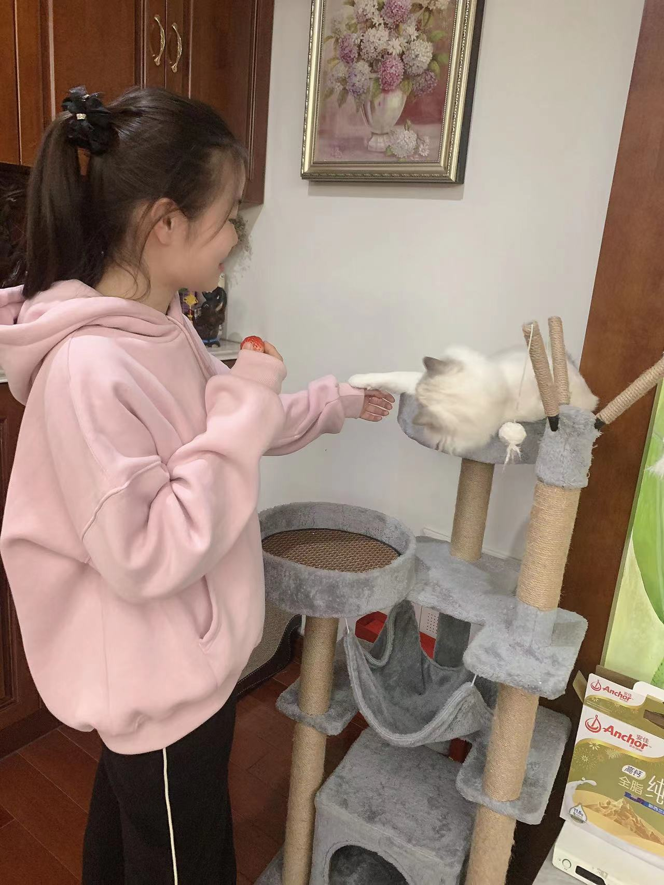
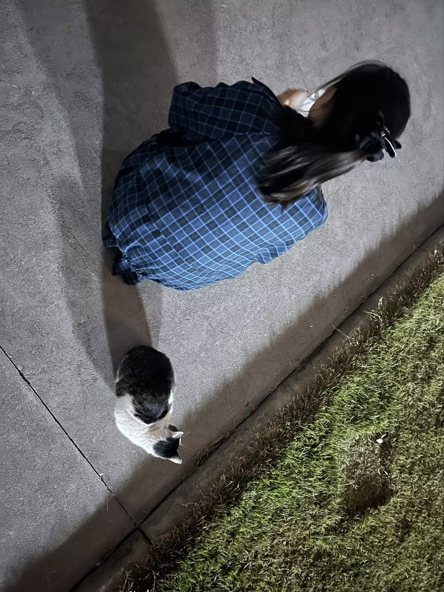
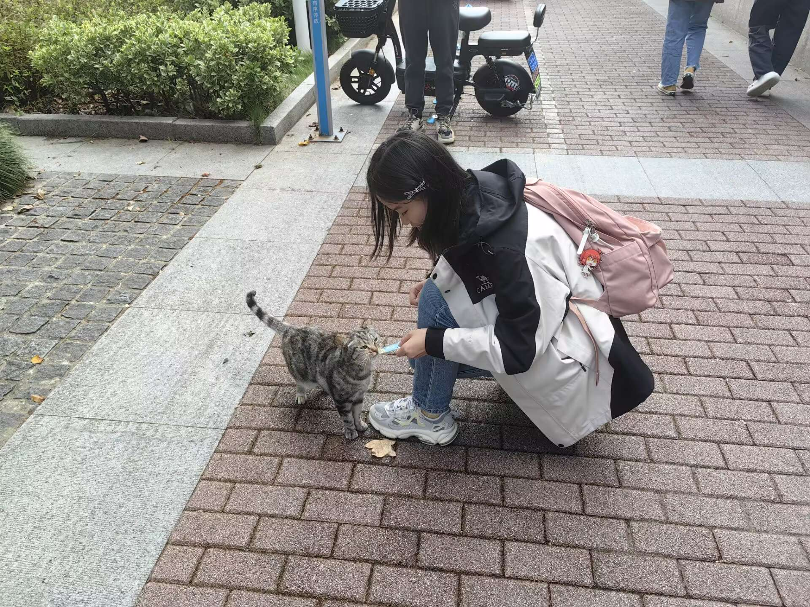
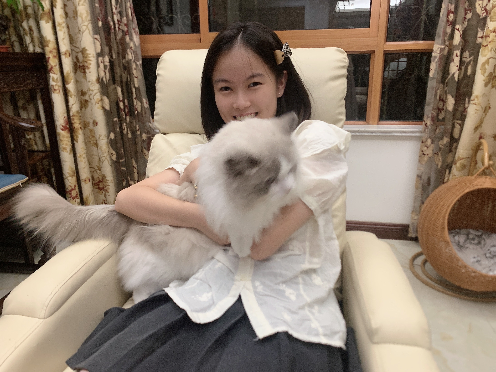

# 👋 Hi, I'm Jieyu Zhou

🎓 Undergraduate at **Nanjing University**, majoring in **Mathematics and Applied Mathematics**  
🎯 Prospective **PhD applicant for Fall 2026**  

## 🔬 Research Interests
- **Statistical Network Analysis**  
- **Generative Models** (diffusion & consistency models)  

## 🧑‍🔬 Current & Past Research
- 📍 **University of Michigan** (Visiting student, 2025)  
  Working on *statistical network analysis* under the supervision of [Prof. Ji Zhu](https://dept.stat.lsa.umich.edu/~jizhu/).  

- ☀️ **Westlake University** (Summer 2024)  
  Research intern at **LINS Lab**, supervised by [Prof. Tao Lin](https://en.westlake.edu.cn/faculty/tao-lin.html).  
  Main focus: *generative models*.  
  Special thanks to [Peng Sun](https://sp12138.github.io/) (PhD student) for guidance.  

## 🌐 Connect with Me
- [LinkedIn](https://www.linkedin.com/in/jieyu-zhou-016a86376/)  
- [Zhihu](https://www.zhihu.com/people/xu-jin-hua-n-25-11)  
- 📧 jieyuzhou@smail.nju.edu.cn | jieyuzh@umich.edu | jieyuzhou_05@163.com  

## 🌟 A Bit About Me
- 🐱 Cat lover — here are some moments with cats:  

  
  
  

  
  

- 🎵 Big fan of **Cantonese songs** — [see my Spotify past 6 months album](images/cantonese-songs/spotify-past-6-months-album.JPG)  

- 🌍 **Language enthusiast** — currently learning **Spanish**, passed the **DELE A1** test 🇪🇸  
  [see my DELE A1 score](images/DELE-A1/Spanish-DELE-A1-score.jpg)  
